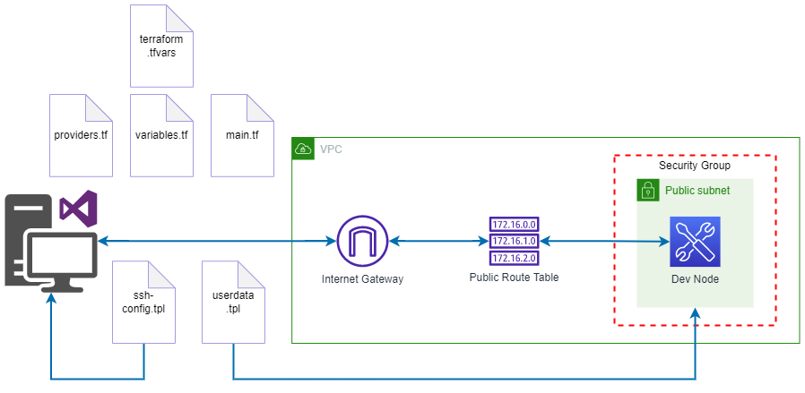

# Terraform

HashiCorp Terraform is an infrastructure as code tool that lets you define both cloud and on-prem resources in human-readable configuration files that you can version, reuse, and share. You can then use a consistent workflow to provision and manage all of your infrastructure throughout its lifecycle. Terraform can manage low-level components like compute, storage, and networking resources, as well as high-level components like DNS entries and SaaS features.

## Build a dev environment with AWS and Terraform

<p align="center">
  
  <br/>
  <span>Infrastructure architecture with terraform and AWS</span>
</p>

## Declarative x Procedural

- In the declarative you declare an intention and terraform turns around to talk to the cloud to configure what you need, which steps have to be done, which orders and so on.

- In procedural you have to know all the steps before doing something.

## Explorando o HCL

O hcl é a linguagem que a hashcorp desenvolveu pra fazer a configuração com o terraform

### Provider block

O provider é o bloco de conexão com alguma coisa que eu quero criar

```tf
provider "algum_provider" {
   // Inputs para o provider
}
```

ex.: AWS, Azure, CGP, Kubernetes, Oracle

```tf
provider "aws" {
   region = "us-east-2"
   profile = "awsena"
}
```

### Resource block

O bloco resource nada mais é do que tentar criar algo, sempre que você for tentar usar o terraform com o comando terraform apply ele vai criar os recursos.

```tf
resource "provider_tipo" "nome" {
   // Inputs para o resource
}
```

o segundo parâmetro é uma referencia interna, você pode verificar a lista de resource no site do terraform.

```tf
resource "aws_instance" "web" {
   ami = data.aws_ami.ubuntu.id
   instance_type = "t2.micro"
}
```

Acessando o valor de um resource

- tipo.nome.algum_output

### Variable block

```tf
variable "nome_de_uma_variável" {
   type = "tipo de variável. string, number, bool, etc."
   default = "essa variável tem algum valor padrão, ou sempre deve ser passada?"
}
```

```tf
variable "idade" {
   type = number
   default = 28
   description = "Qual é a sua idade?"
}
```

### Output block

```tf
output "nome_do_seu_output" {
   value = "algum output de um resource, módulo ou variável"
}
```

```tf
output "idade" {
   value = var.idade
   description = "Sua idade"
}
```

### Data block

```tf
data "provider_tipo" "nome" {
   // Inputs para o data
}
```

```tf
data "aws_ami" "ubuntu" {
   most_recent = true

   filter {
      name = "name"
      values = ["ubuntu/images/hvm-ssd/ubuntu-trusty-14.04-amd64-server-*"]
   }

   filter {
      name = "virtualization-type"
      values = ["hvm"]
   }

   owners = ["099720109477"] # Canonical
}
```

### Module block

```tf
module "name" {
   source = "/caminho/para/seu/modulo"
}
```

```tf
module "name" {
   source = "terraform-aws-modules/vpc/aws"

   name = "my-vpc"
   cidr = "10.0.0.0/16"

   azs = ["eu-west-1a", "eu-west-1b", "eu-west-1c"]
   private_subnets = ["10.0.1.0/24", "10.0.2.0/24", "10.0.3.0/24"]
   public_subnets = ["10.0.101.0/24", "10.0.102.0/24", "10.0.103.0/24"]

   enable_nat_gateway = true
   enable_vpn_gateway = true

   tags = {
      Terraform = "true"
      Environment = "dev"
   }
}
```
